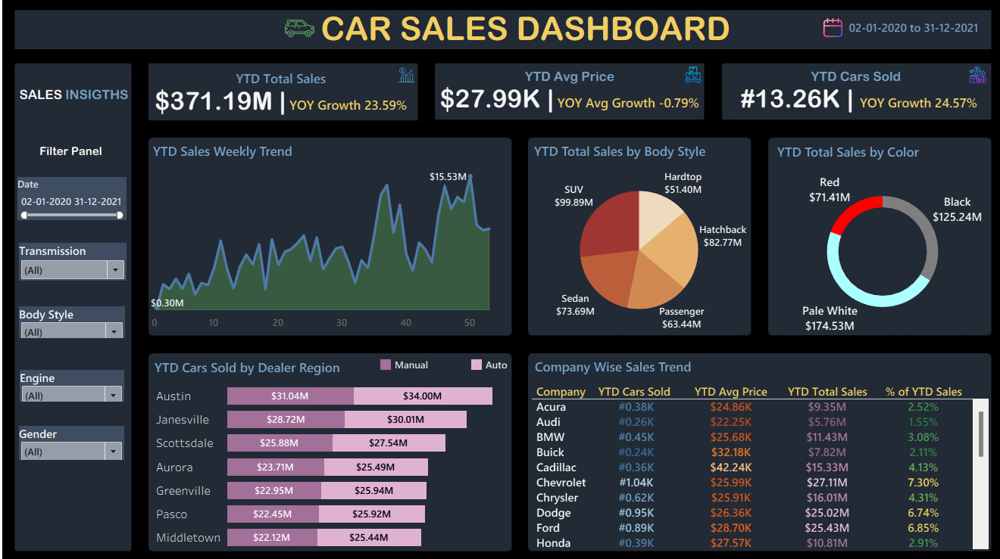

# 🚗 Car Sales Dashboard (Tableau)

## 📌 Project Overview
The **Car Sales Dashboard** is an interactive Tableau dashboard designed to analyze and visualize trends in vehicle sales between **Feb 2020 to Dec 2021**. This dashboard provides deep insights into sales performance, vehicle types, brand performance, and consumer preferences by region and color.

It consists of **multiple visual layers** within a single interactive sheet for comprehensive business understanding.

---

## 🚀 Features & Visuals

### **📈 KPIs & Sales Trends**
- **YTD Total Sales**: `$371.19M` (+23.59% YoY)
- **YTD Avg Price**: `$27.99K` (−0.79% YoY)
- **YTD Cars Sold**: `13.26K` (+24.57% YoY)
- **Weekly Sales Trend**: Line chart showing week-wise sales

---

### **🚘 Sales by Category**
- **Body Style Analysis**: Pie chart showing Hatchback, SUV, Sedan, etc.
- **Color Popularity**: Donut chart showing top-selling colors (e.g., Pale White, Black)
- **Company-wise Breakdown**: Table view with YTD units sold, avg price, and % share
- **Region Performance**: Bar chart by manual/automatic transmission and dealer region

---

### 🧭 Interactive Filters
- **Date Range**
- **Transmission Type**
- **Body Style**
- **Engine Type**
- **Gender**

These filters allow users to drill down and customize the dashboard view.

---

### 🖼️ Sample Dashboard View

---

## 🛠️ Tech Stack
- **Tableau Public Desktop**
- **Excel / CSV Dataset**
- **Calculated Fields** & **Custom Filters**

---

## 📂 Installation & Usage
1. **Clone** or **download** the project repo.
2. Open the `.twb` file using **Tableau Public Desktop**.
3. Ensure the data source path is correctly linked to the dataset in `/data/`.
4. Explore the dashboard using filters and visuals.
5. Use the dashboard for reports, trend analysis, or storytelling.

---

## 📜 License
This project is licensed under the **MIT License**. Click [here](LICENSE) to view details.

---

## 👤 Author
**C Sai Rithvik Reddy**  
📧 sairithvikc@gmail.com  
🔗 [LinkedIn](https://www.linkedin.com/in/sai-rithvik-reddy-c-62b111290/) | [GitHub](https://github.com/rithvikreddy93)

---
